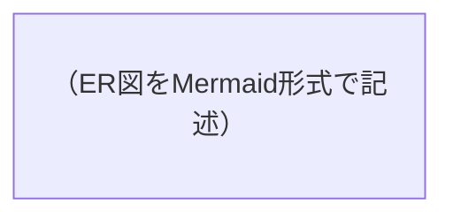

<!-- generation_hints:
- テーブル定義は CREATE TABLE 文に変換可能な粒度で記述する
- RLS ポリシーは auth.uid() を使う具体的な SQL で記述する
- Bubble からのアクセス経路（API Connector / Supabase Plugin）を各テーブルで明記する
- ER図はMermaid形式で記述する
- マイグレーションファイル名は supabase/migrations/ の timestamp 形式（例: 20260209000001_create_xxx.sql）
- Edge Functions は概要のみ。詳細は basic_design / detailed_design で記述
-->
<!-- review_criteria:
- 全テーブルに RLS ポリシーが設計されている
- auth.uid() の参照が正確かつ一貫している
- テーブル間の外部キー制約が明示されている
- Bubble からのアクセス経路が全テーブルで明記されている
- マイグレーション方針が実務で使える粒度（命名規則、ロールバック手順）
- シードデータの方針が明記されている
- Storage バケットにポリシーが設定されている
- Realtime の Publication 設定が明記されている（使用する場合）
-->

# データ設計書（Supabase）
> 本書は Supabase（PostgreSQL + Auth + Storage + Realtime + Edge Functions）を前提としたデータ設計を記述する。テーブル定義は `supabase/migrations/` に配置可能な粒度で、RLS ポリシーは SQL レベルで記述する。
> **全セクション必須**。該当しない場合は「該当なし」と記載し、セクション自体は削除しない。

## 1. サマリ

### スキーマ方針
（全体のデータ設計方針を簡潔に記述）

### 主要設計判断
（重要な設計判断とその根拠を列挙）

---

## 2. テーブル設計

### 2.1 テーブル一覧

| テーブル名 | 概要 | Bubble からのアクセス方法 | 主要カラム |
|---|---|---|---|

### 2.2 テーブル定義

#### {テーブル名}
- **概要**: 
- **Bubble アクセス**: （API Connector / Supabase Plugin / Edge Functions 経由）

| カラム名 | 型 | NOT NULL | デフォルト | 説明 |
|---|---|---|---|---|

- **主キー**: 
- **外部キー**: 
- **インデックス**: 
- **制約**: 

（テーブルごとに繰り返す）

### 2.3 ER 図



---

## 3. RLS ポリシー設計

### 3.1 ポリシー一覧

| テーブル名 | ポリシー名 | 操作 | ロール | 条件概要 |
|---|---|---|---|---|

### 3.2 ポリシー詳細

#### {テーブル名}

```sql
-- SELECT
CREATE POLICY "{ポリシー名}" ON {テーブル名}
  FOR SELECT
  USING (auth.uid() = user_id);

-- INSERT
CREATE POLICY "{ポリシー名}" ON {テーブル名}
  FOR INSERT
  WITH CHECK (auth.uid() = user_id);
```

（テーブルごとに繰り返す）

---

## 4. Supabase Auth 連携

### 4.1 認証方式
（Email/Password, OAuth, Magic Link 等）

### 4.2 auth.users との紐付け
（独自テーブルと auth.users の関連方法。trigger or Edge Function）

### 4.3 ユーザーメタデータ
（raw_user_meta_data に格納する項目）

---

## 5. Supabase Storage 設計

### 5.1 バケット一覧

| バケット名 | public | 概要 | 最大サイズ | 許可 MIME |
|---|---|---|---|---|

### 5.2 ストレージポリシー

```sql
-- 例: ユーザーは自分のファイルのみ操作可能
CREATE POLICY "{ポリシー名}" ON storage.objects
  FOR SELECT
  USING (bucket_id = '{バケット名}' AND auth.uid()::text = (storage.foldername(name))[1]);
```

---

## 6. Realtime 設定

### 6.1 Publication 設定

| テーブル名 | Realtime 有効 | イベント（INSERT/UPDATE/DELETE） | 用途 |
|---|---|---|---|

---

## 7. Edge Functions 一覧（データ観点）

| 関数名 | 概要 | 操作対象テーブル | 認証要否 |
|---|---|---|---|

※ 詳細は基本設計書・詳細設計書で定義する

---

## 8. シードデータ方針

- シードファイル: `supabase/seed.sql`
- 初期投入データ:
  - （マスタデータ等の一覧）
- 適用方法: `supabase db reset`（ローカル DB をリセットしシード適用）

---

## 9. マイグレーション方針

### 9.1 ファイル命名規則
- `supabase/migrations/{timestamp}_{description}.sql`
- timestamp: `YYYYMMDDHHMMSS` 形式
- description: `create_xxx`, `add_rls_xxx`, `alter_xxx` 等

### 9.2 クラウド反映手順
1. ローカルでテスト: `supabase test db`
2. リモートに反映: `supabase db push --linked`

### 9.3 ロールバック方針
（ロールバック用マイグレーションの作成規則、または手動対応方針）

---

## 10. 未決・TODO
-

## 11. レビューステータス
- AIレビュー：未実施 / reviewed / 指摘あり
- ユーザー承認：未承認 / approved
- 備考：
